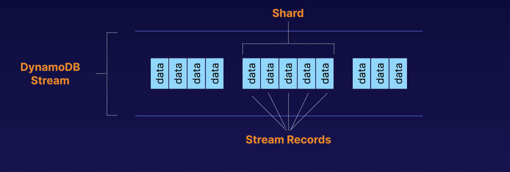

# aws-journey
Notes that I am preparing while learning AWS

# AWS Fundamentals

## Building Blocks of AWS cloud

  - Regions
     - Distributed geographical locations. Region contains 2 or more availability zones.  
  - Availability Zones
     - Group of one or more data centers (building filled with servers) in a region
  - Edge Locations
     - Content caching locations

## AWS Shared Responsibility Model

  - Customer responsibility "Security in the Cloud"
      - If I can do something through AWS console, it is my i.e. customer responsiblity like patching OS in EC2 instance, customer data, IAM , configuring backup of RDS.
  - AWS responsibility "Security of the Cloud"
      - If I can not control something like hardware upgrade, hypervisor, physical security of data centers etc. is AWS responsibility.
  - Encryption is shared responsibility.

## Main AWS Services

  - Compute
      - EC2, Lambda, Elastic Beanstalk
  - Storage
      - S3, EBS, EFS, FSx, Storage Gateway
  - Databases
      - RDS, DynamoDB, Redshift
  - Networking
      - VPC, Direct connect, Route 53, API gateway, AWS global accelerator

## AWS Well Architected Framework

  - Performance Efficiency
  - Cost optimization
  - Operational Excellence
  - Security
  - Reliability
  - Sustainability

# Identity and Access Management (IAM)

  - IAM is universal and not apply to particular region.

## Identity and Access Management (IAM)

  - Root account is the email address you used to sign up for AWS. 
  - It will have full administrative access of AWS.
  - It must be secured using Multi Factor Authentication (MFA)

## Policy Documents

  - Assign permissions using JSON based policy documents.

## Users & Groups

  - User is a physical person.
  - Users should be grouped in Groups.
  - Best practice - permission should be assign to Groups.
  - A user without any policy attached will not have access to any AWS service.

## Roles

  - Allow one service of AWS to interact with another service of AWS.
  - Role is intended to be assumable by anyone who needs it.
  - Roles are temporary. A role does not have standard long-term credentials the same way password or access keys do. When you assume a role, it provides you with a temporary security credentials for your role session.
  - Roles can be assumed by people, AWS architecture or other system-level accounts.
  - Roles can allow cross-account access. This allows one AWS account the ability to interact with resources in other AWS accounts.
  - Roles can be attached or detached to running EC2 instances without stopping them.

## The Principle of Least Privilege

  - Only assign a user the minimum amount of privileges they need to do their job.

# Simple Storage Service S3

  - Object Storage
  - Scalable
  - Unlimited Storage
  - upto 5 TB of files can be stored.
  - File can be of 0 byte also.
  - Store files in buckets (similar to folders)
  - Universal namespace - all S3 bucket name is globally unique.
  - URL to access - https://bucker-name.s3.region.amazonaws.com/file-name-with-extension
  - key-value store - key is file name and value is content of the file.
  - Highly available and highly durable.
  - Access Control Lists (ACLs)
    - ACLs can be attached to individual objects within a bucket to grant or deny access on that particular object.
  - Strong Read-After-Write consistency.
  - Successful file upload through API gives 200 status code.
  - Buckets are private by default.
  - Making bucket content public requires 2 things -
    - Disable Block Public Access.
    - Enable ACL and make public ACL on particular files or add a policy on the bucket which ALLOW read access on all the files in the bucket.

## Static Website on S3

  - Good for hosting static website because it scale on demand automatically.
  - Enable public access on the files for access.

## Versioning Objects in S3

  - All versions are stored in S3 even if you delete an object also.
  - Once enabled, versionining can not be disabled - only suspended.
  - Supports MFA for deletion.
  - Even though bucket is public but old versions of the files will not become public. They have to made public explicitely.
  - Particular version can be deleted permanently.
  - When any object is deleted, it is not deleted parmanently. A delete marker is added only, which can be deleted further to restore the file.

## S3 Storage Classes

### S3 Standard 

 - Data is stored in more than 2 AZs.
 - Default storage class.
 - Designed for frequent access.

### S3 Standard Infrequent Access - S3 Standard-IA

 - less frequently access but requires rapid access like in case of disaster recovery files.
 - per GB retrival fee apply.
 - low per GB stroage price.

### S3 One Zone Infrequent Access

 - Like S3 Standard-IA but data is stored redundantly within a single AZ.
 - Good for non-critical data.
 - Per GB retrival fee apply.
 - low per GB stroage price.

### S3 Intelligent-Tiering

 - Automatically moves data to the most cost-effective tier based on access frequency.
 - Use AI to determine the access patterns.

## Glacier

 - Pay each time for access.
 - Objects are stored in Vaults similar to bucket in S3.
 - Used for long time data archiving.

### Glacier Instant Retrival

- Instant retrival time.

### Glacier Flexible Retrival

  - Flexibiity to retrive large set of data at no cost.
  - Retrival take from minutes up to 12 hours.

### Glacier Deep Archive

  - Most cheapest storage class.
  - Use for storing data for 7-10 years.
  - Retrival takes 12 and bulk retrival can take up to 48 hours.

## Lifecycle Management

  - Automates moving objects between different tiers, thereby maximizing cost effectiveness.
  - Can be used along with versioning to move older versions to different tiers.

 ## S3 Object Lock

   - Use s3 Object Lock to store objects versions using a Write once and read many (WORM) model.
   - Objects versions can be locked for a perdefined period of time called Retention period.
   - Object lock works only in versioned buckets.
   - Placing an object lock on an object protects only the version specified in the request. it doesn't prevent new versions of the object from being created.
   - Object lock can be on individual objects or can be applied on whole bucket.
   - There are two modes of S3 object lock.

### Governance Mode

   - With governance mode, objects versions can be modified or deleted if the person has some special permissions. Retention settings can also be changed using special permissions.

### Compliance Mode
   
   - With Compliance mode, objects versions can not be modified or deleted even by the root user itself. Retention period can't be changed.

### Legal Holds

  - S3 Object Lock which also prevents an object version from being overwritten or deleted.
  - With legal holds, there is no retention period. So it remains effective until removed.
  - With legal holds, S3 objects modification or deletion can be prevented even when retention period is expired.
  - `s3:PutObjectLegalHold` permission is required for adding or removing legal holds.

## Glacier Vault Lock

  - Allows to enforce compliance controls for individual S3 Glacier vaults with a vault lock policy.
  - Controls like WORM can be specified in vault lock policy and lock the policy from future edits. Once locked, the policy can no longer be changed.

## Encrypting S3 Objects

### Encryption in Transit

  - Uses SSL/TLS certificate and https

### Encryption at Rest - Server Side Encryption (SSE)
  
  - 3 ways to do encryption -
      - Using SSE-S3 - Uses S3-managed keys, using AES 256-bit encryption. 
      - Using SSE-KMS - Uses AWS-KMS managed keys.
      - SSE-C - Uses customer-provided keys.

### Encryption at Rest - Client-side encryption
  - Objects are encrypted by client before uploading them to S3.

### Enforce Encryption 

#### Using Console

   - Enable ecryption at AWS console for whole bucket.

#### Using Bucket Policy

   - While uploading a file in S3, request can contain http request header `x-amz-server-side-encryption` with value `AES256` for SSE-S3 or with value `aws:kms` for SSE-KMS. This header indicates that file should be encrypted at upload time using specified SSE keys.
   - Bucket policy can be created for denying request which does not have this header present to enfore encryption at upload time. 

## S3 Performance Optimization

### S3 Prefixes

   - S3 prefix is just a folder or subfolder inside a bucket which contains files.

### S3 Performance

   - S3 supports 5500 GET/HEAD request per second per prefix.
   - SSE-KMS can be a limitation for S3 performance if it is used for encryption.
   - **Multipart upload** can be used for parallelize uploads. It is recommended for files over 100 MB and requires for files over 5 GB
   - **S3 Byte-Range Fetches** parallelize downloads by specifying byte ranges.

## S3 Replication and backup

   - Objects can be replicated from one bucket to another, from one account to another or from one region to another.
   - Versioning must be enabled for replication in source and destination bucket.
   - Objects in existing buckets are not replicated automatically. Once replication is on, all subsequent updated objects will be replicate automatically.
   - Delete markers are not replicated by default but can be turned on.

## S3 Batch Operations

   - S3 batch operations is used to perform operations in all objects or a subset of objects in the bucket.
   - With batch operation, we can -
      - Modify object metadata and properties.
      - Copy objects betweeen buckets.
      - Invoke AWS lambda functions for each object.
   - S3 Batch Replication operation provides way to replicate objects that existed before a replication configuration was in place.

# Elastic Compute Cloud EC2

## EC2 Pricing Options

### On-Demand
  
  - Pay by minute or second depend on the instance type.
  - No commitment of usage.
  - No upfront payment.

### Reserved
   
   - Reserve instances for 1-3 years. 
   - Good for predictable usage.
   - Payment can be done full upfront, partial upfront or none.
   - Full upfront will be the cheapest option. 
   - Reserved instances belongs to only one region.
   - Can be counted against serverless technologies like Lambda and Fargate.

### Standard Reserved Instances

   - Upto 72% discount off the on-demand price.

### Convertible Reserved Instances

   - Up to 54% off the on-demand price.
   - Has the option to change to a different RI type of equal or greater value.

### Scheduled Reserved Instances

   - Lauch within the time window you define.
   - Time window is fixed and recurring that only requires a fraction of a day, week or month usage.

### Spot

   - Purchase unused capacity on discount of up to 90% of on-demand price.
   - Prices fluctuate with supply and demand.
   - Good for stateless, fault-tolerant or flexible applications.
   - If the spot price goes above your maximum purchase price, spot instances either stop or terminate depending on the choice in 2 mins.

#### Spot Block

   - Spot block can be used to stop your Spot instances from being terminated even if the spot price goes above maximum purchase price.
   - Spot block can be set between 1 to 6 hours.

#### Spot Fleets

   - A collection of Spot instances and optionally on-demand instances.
   - Spot fleet will try and match the target capacity with your price restraints.
   - The Spot Fleet selects the Spot capacity pools that meet your needs and launches Spot Instances to meet the target capacity for the fleet. 
   - A Spot capacity pool is a set of unused EC2 instances with the same instance type (for example, m5.large), operating system, Availability Zone, and network platform. When you make a Spot Fleet request, you can include multiple launch specifications, that vary by instance type, AMI, Availability Zone, or subnet. The Spot Fleet selects the Spot capacity pools that are used to fulfill the request, based on the launch specifications included in your Spot Fleet request, and the configuration of the Spot Fleet request. The Spot Instances come from the selected pools.
    - The request for Spot Instances is fulfilled if there is available capacity and the maximum price you specified in the request exceeds the current Spot price.
   - By default, Spot Fleets are set to maintain target capacity by launching replacement instances after Spot Instances in the fleet are terminated. 
   - You can submit a Spot Fleet as a one-time request, which does not persist after the instances have been terminated. You can include On-Demand Instance requests in a Spot Fleet request.
   - Your launch configuration determines all the possible Spot capacity pools (instance types and Availability Zones) from which Spot Fleet can launch Spot Instances. However, when launching instances, Spot Fleet uses the allocation strategy that you specify to pick the specific pools from all your possible pools.
   - There are 4 strategies which can be defined -
      - <b>Capacity Optimized</b> - Spot instances come from the pool with optimal capacity for the number of instances launching. This strategy has the lowest risk of interruption.
      - <b>Diversified</b> - Spot instances are distributed across all pools.
      - <b>Lowest Price</b> - Spot instances come from the pool with the lowest price. This is default strategy. This strategy has the highest risk of interruption.
      - <b>Price capacity optimized</b> It is recommended strategy. Spot Fleet identifies the pools with the highest capacity availability for the number of instances that are launching. This means that AWS will request Spot Instances from the pools that they believe have the lowest chance of interruption in the near term. Spot Fleet then requests Spot Instances from the lowest priced of these pools. The priceCapacityOptimized allocation strategy is the best choice for most Spot workloads, such as stateless containerized applications, microservices, web applications, data and analytics jobs, and batch processing.
      - <b>instancesPoolsToUseCount</b> - The number of spot pools acroos which to allocate your target spot capacity. This parameter is valid only when used in combination with lowestPrice. Spot Fleet selects the lowest priced Spot pools and evenly allocates your target Spot capacity across the number of Spot pools that you specify.

### Dedicated

   - A physical EC2 server dedicated for use.
   - The most expensive option.
   - Should be used when you have -
      - Regulatory requirements that may not support multi-tenant virtualization.
      - Licensing which are not portable or does not support multi-tenancy or cloud deployments.
   - Can be puchased on-demand (hourly)
   - Can be reserved and get upto 70% discount off the on-demand price.

## Burstable performance instances

  - Traditional Amazon EC2 instance types provide fixed CPU resources, while burstable performance instances provide a baseline level of CPU utilization with the ability to burst CPU utilization above the baseline level. 
  - This ensures that you pay only for baseline CPU plus any additional burst CPU usage resulting in lower compute costs. 
  - The baseline utilization and ability to burst are governed by CPU credits. Burstable performance instances are the only instance types that use credits for CPU usage.
  - Each burstable performance instance continuously earns credits when it stays below the CPU baseline, and continuously spends credits when it bursts above the baseline. The amount of credits earned or spent depends on the CPU utilization of the instance -
     - If the CPU utilization is below baseline, then credits earned are greater than credits spent.
     - If the CPU utilization is equal to baseline, then credits earned are equal to credits spent.
     - If the CPU utilization is higher than baseline, then credits spent are higher than credits earned.

  - When the credits earned are greater than credits spent, then the difference is called accrued credits, which can be used later to burst above baseline CPU utilization.
  - Similarly, when the credits spent are more than credits earned, then the instance behavior depends on the credit configuration mode — Standard mode or Unlimited mode.

  - In **Standard mode**, when credits spent are more than credits earned, the instance uses the accrued credits to burst above baseline CPU utilization. If there are no accrued credits remaining, then the instance gradually comes down to baseline CPU utilization and cannot burst above baseline until it accrues more credits.
  - In **Unlimited mode**, if the instance bursts above baseline CPU utilization, then the instance first uses the accrued credits to burst. If there are no accrued credits remaining, then the instance spends surplus credits to burst. When its CPU utilization falls below the baseline, it uses the CPU credits that it earns to pay down the surplus credits that it spent earlier. The ability to earn CPU credits to pay down surplus credits enables Amazon EC2 to average the CPU utilization of an instance over a 24-hour period. If the average CPU usage over a 24-hour period exceeds the baseline, the instance is billed for the additional usage at a flat additional rate per vCPU-hour.

  - The T instance family provides a baseline CPU performance with the ability to burst above the baseline at any time for as long as required. The baseline CPU is defined to meet the needs of the majority of general purpose workloads, including large-scale micro-services, web servers, small and medium databases, data logging, code repositories, virtual desktops, development and test environments, and business-critical applications. The T instances offer a balance of compute, memory, and network resources, and provide you with the most cost-effective way to run a broad spectrum of general purpose applications that have a low-to-moderate CPU usage. They can save you up to 15% in costs when compared to M instances, and can lead to even more cost savings with smaller, more economical instance sizes, offering as low as 2 vCPUs and 0.5 GiB of memory. The smaller T instance sizes, such as nano, micro, small, and medium, are well suited for workloads that need a small amount of memory and do not expect high CPU usage.

## AWS Pricing Calculator - calculator.aws

   - Estimate the cost for moving into cloud.
   - Estimates can be made including EC2, database etc. 

## Connect to EC2 instances

### EC2 Instance Connect
   
   - EC2 instance connect allows for a convenient and secure native SSH connection using short-lived keys.
   - It requires the host security group to permist ssh traffic inbound.
   - It supports only Linux EC2 hosts

###  Session Manager

   - Session manager permits SSH connection tunneled over a proxy connection.
   - Session manager supports Windows and Linux hosts and both EC2 instances and On-prem.

###  SSH Client

   - Connect from your machine using generated keys.

## Security Groups

  - Security groups are virtual firewalls for EC2 instances.
  - By default, all inbound traffic is blocked and all outbound traffic is allowed.
  - Changes to security groups take effect immediately.

## Bootstrap Scripts

  - A script that runs when the instance first runs.
  - It runs at root level.
  - Writing large script adds to the amount of time it takes to boot the instance.
  - Useful for automating the installation of applications.
  - It is also called user data.

## EC2 Metadata

  - Data about EC2 instances like placement groups, local or public IP, security groups etc.
  - Can be accessed inside EC2 instance by curl.
  - Use `curl http://169.254.169.254/latest/meta-data/` to retrive all categories of data.
  - Use `curl http://169.254.169.254/latest/meta-data/<category>` to retrive data of a particular category.

## EC2 Networking

  - Multiple network interface can be attached to EC2 instance.
  - Primany network interface can not be detached from EC instance.
  - 3 differet types of virtual networking cards can be attached to EC2 instances -

## EC2 Instance Types
  - Following are the five different families of instance types:
      - General Purpose
      - Compute-Optimized
      - Memory-Optimized
      - Storage-Optimized.
      - Accelerated Computing
      - HPC Optimized.

### General Purpose Instances: M and T families -
 - General purpose instances provide a balance of compute, memory and networking resources, and can be used for a variety of diverse workloads. 
 - These instances are ideal for applications that use these resources in equal proportions such as web servers and code repositories. 
 - In this family, there are two types of instances:
     - Fixed performance (M6i, M7a, and M7g family )
     - Burstable performance (T3a and T4g Family)
 - M6 instances are the most recent generation of GP instances. These offer a good balance of computing, and memory, network resources and are an excellent choice for applications with high demand for applications and microservices.

### Compute Optimized: C-type family -
  - Compute Optimized instances are ideal for compute bound applications that benefit from high performance processors. 
  -  Instances belonging to this category are well suited for batch processing workloads, media transcoding, high performance web servers, high performance computing (HPC), scientific modeling, dedicated gaming servers and ad server engines, machine learning inference and other compute intensive applications.

### Memory Optimized: R, X, High Memory, and Z families -
  - Memory optimized instances are designed to deliver fast performance for workloads that process large data sets in memory.
  - These circumstances are ideal for running Relational (MySQL) and NoSQL (MongoDB, Cassandra) databases with high performance, in-memory caches.

### Storage Optimized: I, D and H families -
   - Storage optimized instances are designed for workloads that require high, sequential read and write access to very large data sets on local storage. They are optimized to deliver tens of thousands of low-latency, random I/O operations per second (IOPS) to applications.
   - 3/I3en instances include large SSDs for random I/Os required by databases, data warehouses, and distributed systems like Hadoop. They are appropriate for NoSQL databases such as HBase, Cassandra, MongoDB, and OLTP. The D2 instance family is optimized for HDD storage, for high disk throughput.

### Accelerated Computing: P, DL, Trn, G, F, VT and Inf families -
  - Accelerated computing instances use hardware accelerators, or co-processors, to perform functions, such as floating point number calculations, graphics processing, or data pattern matching, more efficiently than is possible in software running on CPUs.
  - These instances are ideal for Hardware accelerators like Graphics Processing Units (GPU), Graphics-intensive applications like game streaming and rendering.

### HPC Optimized: Hpc families -
   - High performance computing (HPC) instances are purpose built to offer the best price performance for running HPC workloads at scale on AWS. 
   - HPC instances are ideal for applications that benefit from high-performance processors such as large, complex simulations and deep learning workloads.

### Elastic Network Interface ENI

  - For basis, day-to-day networking.
  - Low budget, high availability solution.
  - Attached by default to EC2 instances.
  - It allows -
     - Private IPv4 addresses
     - Public IPv4 address
     - Many IPv6 addresses
     - MAC address
     - 1 or more security groups.
  - Use cases -
     - Create a management network or logging network etc with different IP address and differnet subnets in a single AZ.
     - Use network and security appliances with mutiple ENI configuration eg load balancer, NAT, proxy.
     - EC2 instance can have multiple ENIs in different subnets in the same AZ. Such instances are called dual-homed instance. So, ENI can be used to create dual-homed instances with workloads/roles on distinct subnets.

### Enhanced Networking EN

  - Uses <b>Single Root I/O Virtualization (SR-IOV)</b> to provide high performance and lower CPU utilization.
  - SR-IOV allows VMs to bypass hypervisor and talk to hardware directly.

  - High performance networking between 10Gbps - 100 Gbps.
  - Provides higher bandwidth, higher packet per second (PPS) performance and consistently lower inter-instance latencies.

  - No additional charge.
  - All current generation instance types support EN except for T2 instances.
  - Can be enabled using 2 ways -

#### Elastic Network Adaper (ENA)

  - Supports network speeds of up to 100 Gbps for supported instance types.  

#### Intel 82599 Virtual Function (VF) interface

  - Supports network speed of up to 10 Gbps for supported instance types. 
  - Generally used on older instances.

### Elastic Fabric Adapter EFA

  - Accelerates High Performance Computing (HPC) and machine learning applications.
  - Providees lower and more consistent latency and higher throughput than the TCP transport traditionally used in cloud-based HPC systems.
  - EFA is an ENA with an additional <b>OS-BYPASS</b> functionality.
  - OS-bypass enables HPC and machine learning applications to bypass OS kernal and communicated directly with the EFA device. 
  - It makes it a lot faster with much lower latency.
  - It is only supported with Linux, not with Windows.

## EC2 Placement Groups

  - Placement groups can'b be merged.
  - Existing instances can be moved into a placement group but the instance should be in stopped state. Movement can be done through AWS CLI or SDK only.

### Cluster Placement Group

  - Group EC2 instances in a single AZ.
  - Result in Low network latency and high network throughput.
  - AWS recommends homogeneous instances within cluster placement group.

### Spread Placement Group
  
  - Individual EC2 instances are placed on different hardware.
  - Good for critical EC2 instances so that hardware failure of one machine does not stop whole system.
  - Use for individual EC2 instances.
  - Max 7 instances per group per AZ.
  - Can span to multiple AZ.

### Partition Placement Group

  - EC2 instances are grouped and placed on different partitions called Racks.
  - Use for multiple EC2 instances.
  - Can span to multiple AZ.
  - Max 7 partitions in partition group.
  - Amazon EC2 ensures that each partition within a placement group has its own set of racks. Each rack has its own network and power source. No two partitions within a placement group share the same racks, allowing you to isolate the impact of a hardware failure within your application.

## Deploying vCenter in AWS with VMware Cloud on AWS

  - VCenter can be deployed on AWS using VMWare and it is ordered through VMWare themselves.
  - VMware is used by organizations around the world for private cloud deployments.
  - Some organizations opt for a hyrid cloud strategy and wants to connect on-premises cloud to AWS public cloud.
  - Organizations would be migrating to cloud may also be using VMware's built-in tools.
  - It can also be used for Disaster Recovery using hybrid cloud model.
  - vCenter runs on dedicated hardware hosted in AWS using a single AWS account.
  - Each host is capable for running multiple VMware instances (up to 100)
  - Cluster can start with 2 hosts up to a maximum of 16 hosts per cluster. These cluster are vCenter cluster.

## AWS Outposts

  - Outposts bring AWS data center directly to you, on-premises. It extends AWS to your data center.
  - Outposts allow to have large variety of AWS services in your data center.
  - Allows to create a hybrid cloud.
  - Fully managed infrastructure You do not need a dedicated team to look after your outposts infrastructure.
  - Bring the AWS management console, APIs and SDKs into your data center, allowing uniform consistency in your hybrid environment.

## AWS Outposts Family Members

### Outposts Rack

  - Available starting with a single 42U rack and scale up to 96 racks.
  - Gives the same AWS infrastructure, services and APIs in your own data center.
  - It is for large deployments.

### Outposts Servers

  - Individual Servers in 1U or 2U form factor.
  - Useful for small space requirements like retail stores, brnach offices etc.
  - Provides local compute and networking services.
  - It is for smaller deployments.

# Elastic Block Store EBS

  - Storage volumes you can attach to your EC2 instances.
  - Designed for mission critical data
     - Production workloads.
  - Highly available
     - Automatically replicated within a single AZ to protect against hardware failures.
  - Scalable
     - Dynamically increase capacity and change the volume type with no downtime or performance impact to your live systems.

## EBS Volumns types

### EBS Volumns types - Solid State Disk SSD 

### General Purpose SSD

   - A balance of price and performance.

#### gp2

   - Good for boot volumes or development and test applications that are not latency sensitive.

#### gp3

   - New generation.
   - Good for applications that require high performance at a low cost like MySQL, Cassandra, virtual desktops and Hadoop analytics.
   - The top performance of gp3 is 4 times faster than max throughtput of gp2 volumes.
   - Provides IOPS up to 16000

### Provisioned IOPS (PIOS) SSD

#### io1

   - The high performance option and the most expensive.
   - Up to 64000 IOPS per volume.
   - Designed for I/O intensive applications like large databases and latency-sensitive workloads.

#### io2

   - Latest generation
   - io2 is the same price as io1
   - Higher durability and more IOPS.
   - Good for applications that need high level of durability.

### EBS Volumns types - Hard Disk Drive HDD

   - Magnetic drives.
   - Can not be boot volume.

#### Throughput Optimized HDD (st1)

   - Low-cost HDD volume.
   - Frenquently accessed, throughput-intensive workloads like Big data, data warehouses, ETL and log processing.

#### Cold HDD (sc1)

   - Lowest cost option.
   - Good choice for colder data requiring fewer scans per day.
   - Good for applications that need the lowest cost and performance is not a factor like file server.
    

### IOPS

  - Measures the number of read and write operations per second.
  - Important metric for quick transactions, low-latency apps, transactional workloads.
  - The ability to action read and write very quickly.

 ### Throughtput

  - Measures the number of bits read or written per second (MB/s)
  - Important metric for large datasets, large I/O sizes, complex queries.
  - The ability to deal with large datasets.

### Volumns

 - Volumes are simply virtual hard disks.
 - Volumes exist on EBS.
 - Minimum 1 volume is required per EC2 instance which is called root device volume.
 - EBS volumes will always be in the same AZ as EC2.
 - EBS volumes can be resize on the fly without restarting EC2 instance. However, file system need to be extended in the OS so tha OS can see the resized volume.
 - Volume type can also be changed on the fly.

### Snapshots

  - Snapshots exist on S3
  - Point-in-time copy of a volume.
  - Snapshots are incremental. Only the data that has been changed since your last snapshot are moved to S3.
  - First snapshot takes longer as it has to create full copy of the volume.
  - For consistent snapshots, it is recommended to stop the instance and take a snap.
  - Encrypted EBS volume creates encrypted snapshot automatically.
  - Snapshots can be shared but only in the region in which they were created. To share to other regions, you will need to copy them to the destination region first.

### Copy EC2 instance from one region to another

   - Run EC2 instance in one region.
   - Create snapshot of attached EBS volume.
   - Copy snapshot to another region.
   - Create AMI from the copied snapshot.
   - Use this AMI for spinning up EC2 instance.

### EBS Encryption

   - EBS encrypts your volume with a data key using AES-256 algorithm.
   - Amazon EBS encryption uses AWS Key management service (KMS) or customer master keys (CMK) when creating encrypted volumes and snapshots.
   - Once encryption is enabled -
      - Data at rest is encrypted inside the volume.
      - All data in flight moving between the instance and the volume is encrypted.
      - All snapshots are encrypted.
      - All volumes created from snapshot are encrypted.
   - Unencrypted snapshots can be encrypted during copy.
   - Root device volumes can be encrypted upon creation.

### EC2 hibernation

  - Preserves in-memory RAM on persistent storage (EBS)
  - Instances can't be hibernated for more than 60 days.
  - Available for On-demand and Reserved instances.

## Elastic File System EFS

  - Managed Network File System (NFS) that can be mounted on many EC2 instances at the same time.
  - EFS works with EC2 instances in multiple AZ.
  - Highly available and scalable but expensive.
  - A managed NAS (Network Attached Storage) filer for EC2 instances based on Network File System (NFS) version 4.
  - Compatible with Linux based AMI.
  - Encryption at rest using KMS
  - File system scales automatically, no capacity planning required.
  - Pay per use.
  - Performance is very good and can be scaled up to petabytes.
  - Read after write consistency.
  - An EFS file system can be accessed via -
      - Within the same VPC
      - AWS Direct Connect - EFS can be attached to servers running on-premises (on-prem servers)
      - Intra-region VPC peering - Connect to EC2 instances in different AZs
      - Inter-region VPC peering - Connect to EC2 instances in other regions
      - AWS Transit Gateway - Connect to EC2 instances in a different VPC
      - Across accounts via Shared VPC: Connect to EC2 instances across different accounts

### EFS Performance Mode

  - When creating EFS file system, performance characteristics can be set based on IOPS required.

#### General Purpose
  
  - Ideal for a variety of diverse workloads, including high performance and latency-sensitive applications.
  - Used for things like web servers, CMS etc.

#### Max I/O
  - Designed for highly parallelized workloads that can tolerate higher latencies.
  - Used for big data, media processing etc.

### EFS Stroage Class

#### Standard
  - Stores data redundantly across multiple AZs

#### One Zone
  - Stroes data redundantly across single AZ

### EFS Stroage Tiers

  - Eeach EFS storage class comes with 2 different tiers and support lifecycle management.

#### Standard
  - For frequently accessed files.

#### Standard-Infrequent Access
  - For files not frequently accessed.

#### One Zone
  - For frequently accessed files.

#### One Zone-Infrequent Access
  - For files not frequently accessed.

### Throughput mode
  - EFS also provides two throughput modes -

#### Bursting
  - This is the default throughput mode where throughput for file operations scale with the amount of data stored in the file system. EFS provides a baseline rate of 50 KB/s per GB. EFS also provides burst credits that can be used to get a higher throughput for a limited time.
  - It should be used with workloads with varying throughput.
  - In this mode, Burst credits accrue when the file system consumes below its base throughput rate, and are deducted when throughput exceeds the base rate.

#### Enhanced
  - Provides more flexibility and higher throughput levels for workloads -

##### Elastic
  - Use this mode for workloads with unpredictable I/O. With Elastic mode, your throughput scales automatically and you only pay for what you use.
 
##### Provisioned
  - This mode allows you to provision throughput for the file system regardless of the size of the file system. In this case, Amazon charges for both the storage and the throughput provisioned.
  - It should be used with workloads that need consistently high throughtput.

## FSx for Windows

  - Amazon FSx for Windows File Server provies a fully managed native Microsoft Windows file system.
  - A managed windows server than runs **Windows Server Message Block (SMB)** - based file services.
  - Supports AD users, access control lists, groups and security policies along with Distributed File System (DFS) namespaces and replication.

## FSx for Lustre

  - A fully managed file sytem that is optimized for compute-intensive workloads.
  - Good for anything related to AI and ML like -
      - High Performance Computing
      - Machine Learning
      - Media Data Processing Workflows
      - Electronic Design Automation
  - With FSx, Lustre file system can be launched that can process massive datasets at up to hundreds of gigabytes per second of throughout, millions of IOPS and sub-millisecond latencies.
  - It can store data directly on S3.
  - Compatible with all linux.

## Amazon Machine Image AMI

  - AMI is just a blueprint for an EC2 instance.
  - All AMIs are categorized as either backed by -

### Amazon EBS

   - Root device for an instance launched from AMI is an Amazon EBS volume created from an Amazon EBS snapshot.

### Instance Store

   - Root device or an instance launched from AMI is an instance store volume created from a template stored in Amazon S3.

### Instance Store Volumes

   - Ephemeral storage.
   - Cannot be stopped.
   - Reboot of the instance is possible.
   - Once instance is deleted, instance store volume is lost.
   - Instance backed up by instance store can not be stopped.
   - If underlying hardware fails, data is lost.

## AWS Backup

   - It allows to consolidate backups across multiple AWS services.
   - Can be used with AWS orgnanisation which gives centralized control across all AWS services, in multiple AWS accounts across the entire AWS organization.
   - Automated backup schedules and retention policies can be created. 
   - Lifecycle policies can also be created which allows to expire unnecessary backups after a perior of time.
   - It improves compilance. Backup policies can be enforced while backups can be encrypted both at rest and in transit, allowing alignment to regulatory compliance.
   - Auditing also become easy due to a consolicated view of backups.

# Relational Databases

  - Databases engines available in AWS by RDS service -
    - SQL Server
    - Oracle
    - PostgreSQL
    - MySQL
    - MariaDB
    - Amazon Aurora
  - RDS databases run in multiple AZ in which primary database is running in one AZ and secondary database in another AZ in standby mode.
    - AWS handles replication to another AZ.
  - Aurora database is always configured in multiple AZ. Rest database can be run in single AZ.
  - It provides automated failover capability. So, if database in one of the AZ is lost, RDS will automatically fail over to another AZ.
  - Automated backups.
  - RDS is generally used for OLTP databases.

## Increase performance using read replica

  - Replica is read-only copy of primary database.
  - Read replica can be in the same AZ as of primary or it can be in different AZ.
  - Read replica can also be cross-region.
  - The main purpose of read replicas is scalability, whereas the main purpose for multi-AZ deployment is availability.
  - Read replica is mainly used for increasing performance whereas multi-AZ deployment is used for disaster recovery.
  - However, read replica can be used for disaster recovery of the source DB instance either in the same AWS region or in another region.
  - Each read replica has its own DNS endpoint.
  - Read replicas can be promoted to be their own databases. This will break the replication.
  - Automatic backups must be enabled in order to deploy a read replica.
  - Multiple read replicas are supported. Except Aurora, each database engine can have up to 5 read replicas.
  - Read replicas can also have Multi-AZ deployment.

## Aurora
  
  - Amazon Aurora is a MySQL and PostgreSQL-compatible relational database engine that combines the speed and availability of high-end commercial databases with the simplicity and cost-effectiveness of open-source databases.
  - Postgres and MySQL are both supported as Aurora DB (that means your drivers will work as if Aurora was a Postgres or MySQL database.)
  - It is a proprietary technology from AWS. It is not open-sourced.
  - Aurora provides up to 5 times better performance than MySQL on RDS and 3 times better than PostgreSQL databases on RDS at a much lower price point, while delivering similar performance and availability.
  - It provides storage auto scaling. It start with 10 GB and scales in 10-GB increments to 128 TB.
  - 2 copies of data are contained in each AZ, with a minimum of 3 AZ. 
  - Aurora is designed to transarently handle the loss of up to 2 copies of data without affecting database write availability and up to 3 copies without affecting read availability.
  - Aurora storage is also self-healing. Data blocks and disks are continuously scanned for errors and repaired automatically with peer-to-peer replication.
  - Failover in Aurora is instantaneous in less than 30 seconds. Its HA native.
  - Aurora costs more than RDS (20% more) - but is more efficient.
  - Storge is striped across 100s of volumes.

### Aurora Replicas
  
  - There are 3 different types of Aurora replicas -
    - Aurora Replicas
      - 15 read replicas.
    - MySQL Replicas
      - 5 read replicas.
    - PostgreSQL Replicas
      - 5 read replicas.
    - Automated failover is only available with Aurora replicas.
    - Replication process with aurora replicas is much faster.
    - Auto scaling can be configured with read replicas.
    - There is only one reader endpoint for all read replicas. Client will use this reader endpoint and this reader endpoint does connectin load balancing among all available read replicas. It does load balancing at connection level, not at statement level.
    - Data can be restored at any point of time using backtrack.

### Aurora Backups
   - Automated backups are always enabled.
   - Backups do not impact database performance.
   - Snapshots can also be taken which will again have no impact on performance.
   - Snapshots can be shared with other AWS accounts.

## Amazon Auora Serverless
    - An on-demand, auto-scaling configuration for the MySQL-compatible and PostgreSQL-compatible editions of Amazon Aurora.
    - An Aurora Serverless DB cluster automatically starts up, shuts down, and scales capacity up or down based on your application's needs.
    - Aurora serverless provides a relatively simple, cost-effective option for infrequent, intermittent, or unpredictable workloads.

# DynamoDB

- Amazon DynamoDB is a fast and flexible NoSQL database service for all applications that need consistent, single-digit millisecond latency at any scale.
- It is fully managed database and supports both document and key-value data models.
- Its flexible data model and reliable performance make it a great fit for mobile, web, gaming ad-tech, IoT, and many other applications.
- Data is stored on SSD storage.
- It is spread across 3 geographically distinct data centers.
- Eventually consistent reads is provided by default.
- One can opt for strong consistent reads also.
- Pay-per-request pricing.
- No minimum capacity required.
- No charge for read/write. Only storage and backups are charged.
- Pay more per request than with provisioned capacity.

## DynamoDB Accelerator (DAX)

 - Fully managed, highly available, in-memory cache of DynamoDB.
 - It improves performane by 10x.
 - Request time is reduced from milliseconds to microseconds even under load.
 - There is no need for developers to manage caching logic.
 - Compatible with DynamoDB API calls.

## Security
  - One can connect to DynamoDB using Site-to-site VPN, Direct Connect (DX) and VPC endpoints etc.

## DynamoDB Transactions

- DynamoDB transactions provide developers atomicity, consistency, isolation and durability (ACID) across 1 or more tables within a single AWS accunt and region.
- There are 3 options available for reads -
   - Eventual consistency.
   - Strong consistency.
   - Transactional consistency.
- There are 2 options for writes -
   - Standard
   - Transactional

## DynamoDB Backups
- Full backups at any time.
- Zero impact on table performance or availability.
- Consistent within seconds and retained until deleted.
- Operates within same region as the source table.

### Point-in-Time Recovery (PITR)

- Protects agian accidental writes or deletes.
- Restore to any point in the last 35 days.
- Incremental backups
- Not enabled by default.
- Latest restorable - 5 mins in the past.

## DynamoDB Streams
- Time ordered sequence of item-level changes in  table
- These changes are stored in streams for 24 hours.
- Sequences are broken up into shards. Shard is just a bunch of data that has sequential sequence numbers.
- Inserts, updates and deletes changes are published to streams.
- Can be combined with lambda functions for functionality like stored procedures.

## Global Tables

 - Managed Multi-master and multi-region replication.
 - Based on dynamoDB streams.
 - No application changes required.
 - Replication latency under 1 second.

# Document DB

 - Allows to run MongoDB on AWS
 - Fully managed service.

# Amazon Keyspaces

 - Amazon' Apache Cassandra database service.
 - fully managed service.

# Amazon Neptune

 - Amazon graph database service.
 - Fully managed service.

# Amazon Quantum Ledger Database (QLDB)

- Ledger database is a NoSQL database that is immutable, transparent and has a cryptographically verifiable transaction log that is owned by one authority.
- A record can not be updated in a ledger database. Instead, an update adds a new record to the database.
- It is used for cryptocurrencies such as Bitcoin, Etherum etc.
- QLDB is a fully managed ledger database.

# Amazon Timestream

 - A serverless, fully managed database service for time-series data.

# VPC
 - Every AWS account in every region has a default VPC.
 - All subnets in default VPC have a route out to the internet.
 - Each EC2 instance in default VPC has public as well as private IP address.
 - However, custom VPC does not have public IP address enabled by default.
 - Logically isolated part of AWS cloud where you can define your own network.
 - When a VPC is created, it also creates a route table, network ACL, security group and a router.
 - Internet gateway is attachd to VPC to enable internet access of the EC2 instance.
 - There can be only one internet gateway per VPC.
 - Virtual Private gateway can be attached to VPC to establish a VPN connection from corporate data center.

 - There are 2 values for Tenancy -
     - Default - 
     - Dedicated - it costs a lot.

## CIDR
  - Smallest network size AWS supports is 10.0.0.0/28 which will give 16 IP addresses.
  - If IPAM (IP address manager) pool is available, we can get CIDR ranage from the IPAM pool.
  - CIDR block size must have a size between /16 and /28
  - The first 4 IP addresses and the last IP address in each subnet CIDR block are not available for use.
  - For example, in a subnet with CIDR block 10.0.0.0/24, following 5 IP addresses are reserved -
      - 10.0.0.0 - network address
      - 10.0.0.1 - reserved by AWS for VPC router.
      - 10.0.0.2 - reserved by AWS for DNS server.
      - 10.0.0.3 - reserved for future use.
      - 10.0.0.255 - Network broadcast address. AWS does not support broadcast in a VPC, therefore it is reserved.

## subnet

  - subnet is basically a virtual firewall.
  - 1 subnet will always be in 1 AZ.
  - There are 2 kinds of subnet -
     - public which are accessible from  internet
     - private which are not accessible from internet.
  - If any subnet is not associated with any route table explicitely, it gets associated implicitly with main route table.
     - So, if main route table has route to the internet gateway, then all implicit subnets become public.
  

## Hardware Virtual Private Network (VPN)

 - Hardware Virtual Private Network connection can be created between corporate data center and VPC which will allow to use AWS as an extension of corporate data center.

## NAT Gateway

  - Network Address Translation (NAT) gateway enables instances in private subnet to connect to internet and other AWS services while preventing the internet from initiating a connection with those instances.
  - NAT gateway is collection of EC2 instances in a AZ and it is managed by AWS behind the scene. NAT gateway is redundant inside AZ.
  - NAT gateway is not associated with any security group.
  - NAT gateway is automatically assigned a public IP v4 address.
  - NAT gateway is created in a subnet.
  - NAT gateway is placed in public subnet. Instances of private subnet connect to NAT gateway for accessing internet.
  - For accessing internet from private subnet, route is added to NAT gateway in the route table.

## Security Groups

 - While connecting from outside, first route table comes into picture and then network ACLs comes and lastly security group.
 - Security groups are stateful - if you send a request from the instance, the response traffic for that request is allowed to flow in regardless of inbound security group rules.
 - Similarly, responses to allowed inbound traffic are allowed to flow out, regardless of outbound rules.

## Network ACLs
- A network ACL is an optional layer of security for VPC that acts as a firewall for controlling traffic in and out of one or more subnets.
- Network ACL is first line of defense.
- VPC automatically comes with default network ACLs which allows all inbound and outbound traffic.
- Custom network ACLs can also be created. Custom network ACLs by default deny all inbound and outbound traffic.
- Each subnet in VPC must be associated with a network ACL. If there is no explicit assoication between a subnet and network ACL, the subnet is automatically associated with default network ACL.
 - ACL is used to block specific IP addresses. Security groups can not be used for blocking IP addresses.
 - Each network ACL can be assoicated with multiple subnets but a subnet can be assoicated with only 1 network ACL at a time.
 - Network ACLs contain a numbered list of rules that are evaluated in order, starting with the lowest numbered rule.
 - Network ACLs have separate inbound and outbound rules and each rule can either allow or deny  traffic.
 - Network ACLs are stateless i.e. responses to allowed inbound traffic are subject to the rules of outbound traffic and vice versa. That is why, ephemeral ports are added in network ACL allow list for enabling responses to be sent back to client.

## VPC endpoints
  - A VPC endpoint enables you to privately connect your VPC to supported AWS services and VPC endpoint services which are powered by PrivateLink without requiring an internet gateway, NAT device, VPN connection or AWS Direct Connect connection.
  - Intances in VPC do not require public IP addresses to communicate with resources in the service.
  - Traffic between VPC and other services does not leave Amazon network.
  - Endpoints are virtual devices.
  - They are horizontally scaled, redundant and highly available VPC components that allow communication between instances in your VPC and services without imposing availability risks or bandwidth constraints on your network traffic.
  - There are 3 types of endpoints
     - Interface endpoints - An interface endpoint is an elastic network interface (ENI) with a private IP address that serves as an entry point for traffic headed to a supported service. They support a large number of AWS services. These are powered by AWS PrivateLink. Interface endpoints are generally accessed using the public or private DNS name associated with the service.
     - Gateway Load Balancer endpoints - Gateway load balancer endpoints are also pwoered by AWS PrivateLink and uses ENI as an entry point for traffic destined to the service. However, gateway load balancer endpoints serve as a target for a route in your route table for traffic destined for the service.
     - Gateway endpoints - Similar to NAT gateways, a gateway endpoint is a virtual device you provision. It supports connection to S3 and dynamoDB. Gateway endpoints serve as a target for a route in your route table for traffic destined for the service.

## VPC Peering

   - VPC peering allows to connect 1 VPC with another via a direct network route using private IP addresses.
   - Instances behave as they were in the same private network.
   - You can peer VPCs with other AWS accounts as well as with other VPCs in the same account.
   - Peering is in star configuration e.g. 1 central VPC peers with 4 others.
   - No transitive peering.
   - You can peer between regions.
   - VPCs to be peered can not have overlapping CIDR ranges.

## AWS PrivateLink

   - 

# To Explore
 - https://docs.aws.amazon.com/AWSEC2/latest/UserGuide/elastic-ip-addresses-eip.html 
